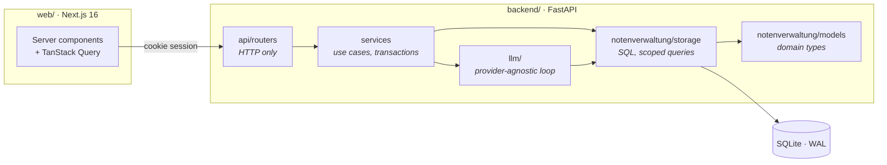

<div align="center">

# Grade Tracker

**Academic records, reporting and AI-assisted workflows — built for the people who actually have to enter the marks.**

[](https://github.com/gwarrar/grade_tracker_new/actions/workflows/ci.yml)


</div>

---

## What it does

A gradebook for a single institution: students, courses, enrolments and marks, with
the reporting and administration built around them.

**Recording marks.** Entry is a roster, not a form — you state the assessment once
and type down a column, rather than picking a course, a student, a title, a date and
a weight thirty times over. Bulk import accepts CSV and `.xlsx`, maps the columns for
you, and reports failures per row so one typo in row 4 does not cost the other 299.

**Reporting.** Per student, per course, per teacher, per term, per assessment, plus
enrolment and distribution breakdowns and an institution-wide summary. Everything
exports to CSV with localized headers; the transcript is a print stylesheet rather
than a generated PDF, so it carries the institution's own branding and fonts.

**Who sees what.** Four roles. A student sees themselves; a teacher sees the students
enrolled on courses they own, intersected with those courses; an administrator sees
everyone. This is enforced as a SQL fragment composed into every query, not as a
check at the top of each handler — see [Authorization](#authorization) below.

**An assistant that cannot lie to you.** Ask a question in plain language and it
answers by running real, scoped SQL through a fixed set of tools, showing the rows it
used underneath the answer. It can *propose* a write, but there is no code path by
which it performs one.

**Administration.** Branding (with a contrast gate that refuses unreadable colour
choices), the grading scale, three interface languages with per-key overrides, user
accounts and one-time passwords, an append-only audit trail, and per-feature AI
provider routing with cost tracking.

---

## Architecture



Three things carry most of the design, and each is enforced rather than asked for:

**Layers only depend downward.** `tests/unit/test_architecture.py` parses every
module with `ast` and fails the build on an upward import, or on SQL in a router.

<a name="authorization"></a>
**Authorization is a value, not a branch.** `services/scoping.py` turns a principal
into a SQL fragment that storage splices into `WHERE`. The default is `DENY_ALL`
(`"1=0"`), so a query handed no scope returns nothing:

> A forgotten filter shows up as an empty table, which someone reports. The opposite
> default shows up as one student reading another's grades, which nobody reports.

**Errors are codes, never prose.** Every failure is RFC-9457 `application/problem+json`
whose `code` is the contract. The backend ships no message catalogue; the frontend
maps codes to text in the reader's language.

The reasoning behind these — and what would reverse each of them — is in
**[docs/DECISIONS.md](docs/DECISIONS.md)**, twenty entries each with an explicit
reversal trigger.

---

## Local development

**Prerequisites:** Python 3.12 · [uv](https://docs.astral.sh/uv/) · Node.js 22 ·
pnpm 11 via Corepack — **run it as `corepack pnpm`, not `pnpm`**.

`web/package.json` pins `pnpm@11.18.0` and `web/.npmrc` sets a shared `store-dir`. A
globally installed `pnpm` is usually older, and it will refuse to work against a
`node_modules` that pnpm 11 built — the error names a store mismatch rather than a
version, which is why it is worth stating here.

```powershell
corepack enable
corepack prepare pnpm@11.18.0 --activate
```

Create the environment file once, then start everything:

```powershell
Copy-Item .env.example .env      # configure an AI provider key only if testing AI
.\dev.cmd                        # migrate, seed if empty, start both, wait until they answer
```

| Command | What it does |
|---|---|
| `.\dev.cmd` | Starts rather than restarts — anything already listening is left alone |
| `.\dev.cmd restart` | After a backend change: uvicorn runs without `--reload` here |
| `.\dev.cmd fresh` | Restart, deleting `web/.next` first — for a broken dev build |
| `.\dev.cmd stop` / `status` / `logs` | Both servers are detached and windowless, so `logs` is the only way to read their output |

- Application: <http://localhost:3000>
- API documentation: <http://localhost:8000/docs>

Every demo account uses the password printed by the seed:
`admin@gradetracker.test` (superadmin), `registrar@gradetracker.test` (admin),
`t.weber@gradetracker.test` (teacher), and a student login printed alongside them.

> **Do not run `pnpm build` while the frontend is up.** Both write `web/.next`, and
> Turbopack's cache does not survive two writers — it stops emitting chunks
> mid-build, every route then answers 500, and no ordinary restart clears it because
> the production marker it looks for is already gone. Stop the servers first, or run
> `.\dev.cmd fresh` afterwards.

<details>
<summary>Running the two halves by hand instead</summary>

```powershell
# terminal one
Set-Location backend
uv sync
uv run python -m api.migrate
uv run python -m api.seed
uv run uvicorn api.main:app --reload

# terminal two
Set-Location web
corepack pnpm install
corepack pnpm dev
```

</details>

---

## Verification

```powershell
Set-Location backend
uv run pytest --cov          # 865 tests, ≥85% enforced, 93% actual
uv run ruff check .          # pycodestyle, pyflakes, bandit, bugbear, pydocstyle
uv run ruff format --check .
uv run pyright               # strict, over src/ tests/ and scripts/

Set-Location ..\web
corepack pnpm check          # typecheck + eslint + 213 tests, in one command
```

CI runs both suites on every push to every branch, plus two drift gates: the
committed OpenAPI document is regenerated and diffed, and so are the TypeScript types
derived from it. A spec that moves without its types being regenerated fails the
build rather than producing a client that describes an API which no longer exists.

---

## Documentation

| | |
|---|---|
| [Roadmap](docs/ROADMAP.md) | What is open, in the order it will be built — **the current backlog** |
| [Architecture](docs/ARCHITECTURE.md) | Request lifecycle, layering, scoping, sessions, storage, the LLM layer |
| [Decisions](docs/DECISIONS.md) | Twenty contested choices, each with what would reverse it |
| [Backend guide](backend/README.md) | Layers, migrations, how to add an endpoint |
| [Frontend guide](web/README.md) | Routing, the data layer, the design system, testing |
| [Security](SECURITY.md) | Sessions, password storage, the scope model, reporting a vulnerability |
| [OpenAPI document](docs/openapi.json) | 60 paths, generated and drift-gated |

`docs/ROADMAP.md` is the current backlog.

---

## Licence

[MIT](LICENSE).
